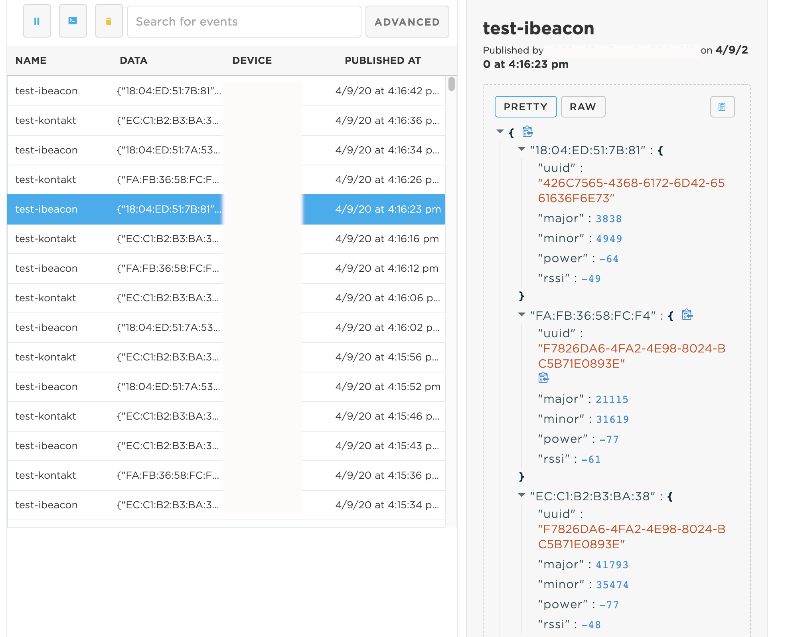

# Beacon Scanner

This library works with Particle Gen3 devices to scan for BLE advertisements and parses them for common beacon standards. Currently supported:
* iBeacon
* Eddystone UID, URL, and unencrypted TLM
* Kontakt.io beacons (tested with Asset Tag S18-3)
* Laird BT510 beacons, including connecting to them for changing configuration
* KKM beacons (tested with Waterproof Beacon K8)

## Functions available

There are a few functions that an application can call depending on the needs of the use case.

### __NEW in Version 1.0.0__ Continuous threaded scanning

In this mode, the application no longer needs to block when doing a scan. Instead, start the continuous mode with
the following API. This will most likely go in `setup()` if the Application is always scanning:

```c++
Scanner.startContinuous();
```

For callbacks and removal of "stale" beacons (those that go out of range), it is required to periodically
call the `loop()` function in the library. This can be added to the application's `loop()`:

```c++
void loop() {
    // Other code here
    Scanner.loop();
}
```

The application can set the duration of each scan period by calling `setScanPeriod(uint8_t seconds)`. The default
is 10 seconds. This period is important to decide when to remove beacons from the Vectors, as that is done when
a whole period has elapsed without that beacon being detected. That logic can be changed by calling
`setMissedCount(uint8_t count)` and adjusting from 1 missed period to a larger number of periods.

One way of using the continuous mode, is to register a callback function that will get called each time a beacon
comes into range or goes out of range. To do so, declare a callback function like this:

```c++
void onCallback(Beacon& beacon, callback_type type) {
  Log.trace("Address: %s. Type: %s", beacon.getAddress().toString().c_str(), (type == NEW) ? "Entered" : "Left");
}

void setup() {
    // Other setup
    BLE.on();
    Scanner.setCallback(onCallback);
    Scanner.startContinuous();
}
```

Another option instead of callbacks (or in addition), the application can at any time get Vectors of the most recently 
scanned beacons like this (note that if the application consumes the beacons, callbacks of type `NEW` will be issued
when they are scanned again). 

The following example doesn't consume the beacons:

```c++
for (auto i : Scanner.getKontaktTags()) {
    Log.info("Address: %s, Temperature %u", i.getAddress().toString().c_str(), i.getTemperature());
}
```

You can also provide a `JSONWriter` instance to the `toJson()` function of a beacon, to have it automatically
generate the JSON for the application. This might be useful if you want to add the values to your own Publish
event, or if you have a Tracker and are using the Tracker's location object to add the beacons to. Using it
in the Tracker would look like this:

```c++
void locationGenerationCallback(JSONWriter &writer, LocationPoint &point, const void *context)
{
    for (auto i : Scanner.getKontaktTags()) {
        i.toJson(&writer);
    }
}
void setup() {
    // Other setup
    Tracker::instance().init();
    Tracker::instance().location.regLocGenCallback(locationGenerationCallback);
    BLE.on();
    Scanner.startContinuous();
}
```

Or have the library automatically publish. This function consumes the beacons in the Vectors, so if callbacks are
enabled, they will be called with type `NEW` if the beacons are detected again.

```c++
Scanner.publish("all");
```

### Automatic Scan and Publish

In this mode, the library will scan for BLE advertisements, and use Particle.publish() to send the data to the cloud.

```c++
void scanAndPublish(uint16_t duration, int flags, const char* eventName, PublishFlags pFlags, bool memory_saver)
/*
duration:   How long to collect data, in seconds
flags:      Which type of beacons to publish. Use bitwise OR for multiple. e.g.: SCAN_KONTAKT | SCAN_IBEACON | SCAN_EDDYSTONE
eventName:  The cloud publish will use this event name, and add "-ibeacon","-kontakt","-eddystone"
pFlags:     Flags for the publish, e.g.: PRIVATE
memory_saver: Default is false. If set to true, it will publish more often and use less memory. Caution, this means that some data might not be collected from beacons that advertise multiple times with different data.
*/
```

The output of this on the console looks like (with eventName "test"):




### Get a Vector of the detected tags

If the application needs to get the data, rather than automatically publishing it, this can be accomplished by first running a scan using the following function:

```c++
void scan(uint16_t duration, int flags)
/*
duration: How long to collect data, in seconds (default: 5)
flags: Which type of beacons to publish. Use bitwise OR for multiple. e.g.: SCAN_KONTAKT | SCAN_IBEACON | SCAN_EDDYSTONE (default: all)
*/
```

And then the data for each supported type of advertiser can be retrieved as a Vector:
```c++
Vector<KontaktTag> getKontaktTags();
Vector<iBeacon> getiBeacons();
Vector<Eddystone> getEddystone();
```

### A note on "duration"

This is how long the library will listen for beacons. However, during that time a beacon might advertise multiple times. The library will NOT publish every time the beacon advertises.

For a Kontakt tag, all the values will be based on the last received packet for each address detected.

For an iBeacon, all the values will be based on the last received packet except for RSSI. The RSSI will be an average of all the received values during the scan duration.

## Typical usage

```c++
#include "Particle.h"
#include "BeaconScanner.h"

SYSTEM_THREAD(ENABLED);

void setup() {
}

unsigned long scannedTime = 0;

void loop() {
    if (Particle.connected() && (millis() - scannedTime) > 10000) {
        scannedTime = millis();
        Scanner.scanAndPublish(5, SCAN_KONTAKT | SCAN_IBEACON | SCAN_EDDYSTONE, "test", PRIVATE);
    }
}
```

## Typical Tracker usage

```c++
#include "Particle.h"
#include "tracker_config.h"
#include "tracker.h"
#include "BeaconScanner.h"

SYSTEM_THREAD(ENABLED);
SYSTEM_MODE(SEMI_AUTOMATIC);

PRODUCT_ID(TRACKER_PRODUCT_ID);
PRODUCT_VERSION(TRACKER_PRODUCT_VERSION);

STARTUP(
    Tracker::startup();
);

void locationGenerationCallback(JSONWriter &writer, LocationPoint &point, const void *context)
{
     for (auto i : Scanner.getKontaktTags()) {
        i.toJson(&writer);
    }
}

void setup()
{
    Tracker::instance().init();
    Tracker::instance().location.regLocGenCallback(locationGenerationCallback);
    BLE.on();
    Scanner.startContinuous();
}


void loop()
{
    Tracker::instance().loop();
    Scanner.loop();
}
```

## Examples

* __Log:__ Starts a scan for iBeacons, Kontakt tags, and Eddystone beacons, and then logs the address, major, and minor of the beacons, address and temperature of the tags, and address of Eddystone
* __Publish:__ Starts a scan which publishes all the types of devices
* __Tracker Continuous:__ With a Tracker, continuously scan and publish the most recently detected when the Tracker decides to publish
* __Tracker Callback:__ With a Tracker, continuously scan, and use callbacks to alert the application when a beacon has been newly detected, or has been missed for more than 10 seconds. The callback function will store these events, and then append them to the normal location publish.
* __Laird BT510 Log:__ This example logs when it receives alarms and events from the Laird BT510 beacon. It also exposes a function that can be called from the Particle Cloud with JSON to reconfigure the settings of the beacons that are nearby.
